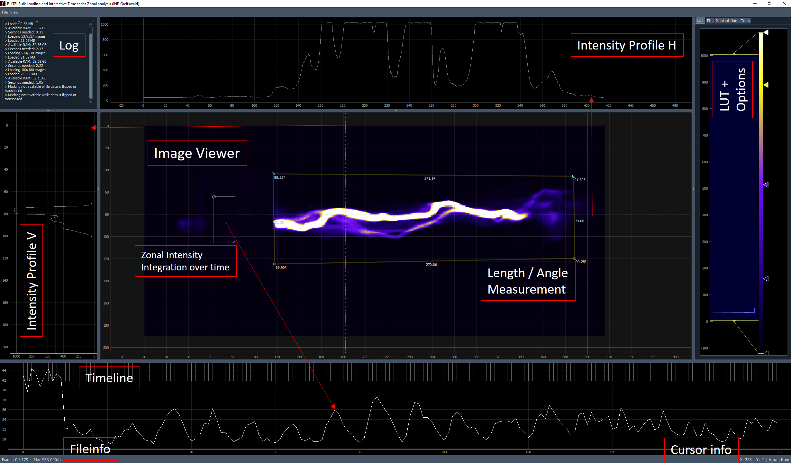

# BLITZ
**B**ulk **L**oading and **I**nteractive **T**ime series **Z**onal analysis



This project is being built at the [INP Greifswald](https://www.inp-greifswald.de/).

## Quick Start

### Portable Version

On Windows, BLITZ can directly be used with the already compiled program (.exe) in the [most recent
release](https://github.com/CodeSchmiedeHGW/BLITZ/releases/latest).

### Compiling and Developing

It is recommended to use [poetry](https://python-poetry.org/) for local development. After cloning
this repository, create a virtual environment, install all dependencies and run the application.

```shell
$ git clone https://github.com/CodeSchmiedeHGW/BLITZ.git
$ cd BLITZ
$ poetry install
$ poetry run BLITZ
```

You can also build your own portable executable using `pyinstaller`:

```shell
$ pyinstaller --onefile --windowed --icon=resources/icon/blitz.ico blitz.py
```

## License

BLITZ is licensed under the terms of the GNU General Public License version 3 (GPL-3.0). Details
can be found in the [LICENSE](LICENSE) file.
