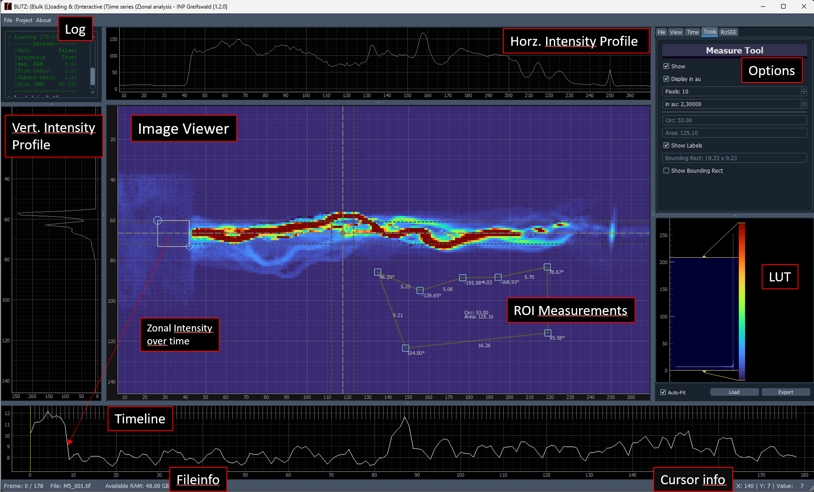
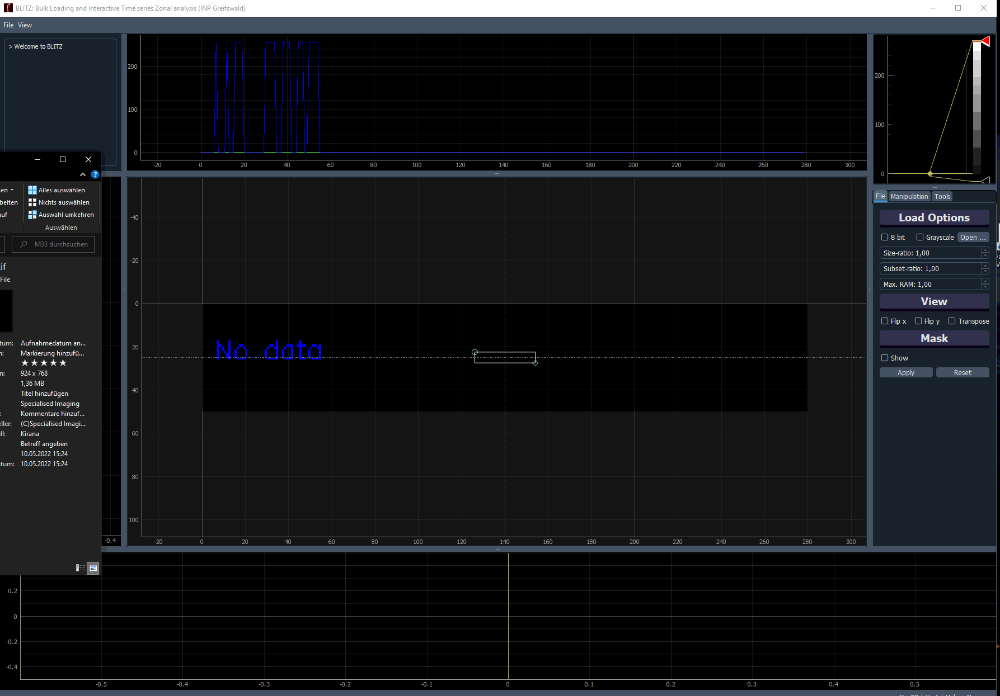

# BLITZ

## TL;DR
**BLITZ** is a matrix-based image viewer designed for handling massive datasets (25+ GB) quickly and efficiently, but also works well for single images. (i.e. it can load 21,000 images (~25GB) in 35 seconds on a gaming laptop).

## Download
[Download the latest release for Windows](https://github.com/CodeSchmiedeHGW/BLITZ/releases/latest)

## Overview
**BLITZ** (Bulk Loading and Interactive Time series Zonal analysis) is an open-source image viewer developed at [INP Greifswald](https://www.inp-greifswald.de). It is designed for rapid loading and processing of large image datasets, but is equally effective for single-image analysis.

**Key Features:**
- **Fast Data Handling:** Handles very large datasets efficiently (i.e. 21,000 images (~25GB) in just 35 seconds on a standard gaming laptop).
- **Easy Data Handling:** Drag-and-drop functionality for various image and video formats, including NUMPY matrices (*.npy).
- **Easy-to-use:** Automatic resource management for large and small datasets.
- **User-Friendly Interface:** Intuitive GUI with mouse-based navigation and shortcut capabilities.
- **Advanced Image Processing:** Matrix-based processing, with fast statistical calculations (i.e. Mean image of the 21k dataset: 1.7 seconds).
- **Built on Python**, with Qt and PyQtGraph for high performance and flexibility




---
(Click if animation is not playing)


---

## Documentation

- [Quick Start Guide](docs/walkthrough.md)
- [Core Functionalities](docs/Tabs_explained.md)

## Development

To compile and develop locally:

1. Clone the repository:

        $ git clone https://github.com/CodeSchmiedeHGW/BLITZ.git
        $ cd BLITZ

2. Set up a virtual environment and install dependencies:

        $ pip install poetry
        $ poetry install
        $ poetry run python -m blitz

    Sometimes the installation with poetry might fail due to package restrictions with ``PyQt5``.
    For a quick fix, comment out the following three lines in [pyproject.toml](pyproject.toml).
    ```
    # PyQt5 = "^5.15.11"
    # pyqtgraph = "^0.13.7"
    # QDarkStyle = "^3.2.3"
    ```
    Afterwards, just install these packages via ``pip`` inside the newly created virtual
    environment:

        $ poetry shell
        $ python -m pip install PyQt5==5.15.11
        $ python -m pip install pyqtgraph==0.13.7
        $ python -m pip install QDarkStyle==3.2.3

3. To create a binary executable:

        $ pyinstaller --onefile --noconsole --icon=./resources/icon/blitz.ico blitz_main.py

## Additional Resources

- Example Dataset: [KinPen Science Example Set](https://www.inptdat.de/dataset/fast-framing-images-kinpen-science-example-set-images-testing-blitz-image-viewer)
- Explore more datasets or contribute your own on [INPTDAT](https://www.inptdat.de).

## License

BLITZ is licensed under the [GNU General Public License v3.0](LICENSE).