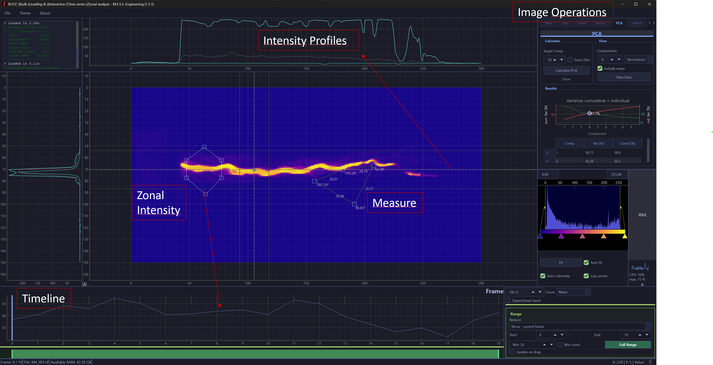

# BLITZ

## TL;DR

**BLITZ** is a high-performance, matrix-based image viewer for efficiently managing massive datasets and single-image analysis.  
Version 2.0 features a fully refactored architecture with improved performance, stability, and maintainability.

## Download

[Download the latest release for Windows and Ubuntu](https://github.com/PiMaV/BLITZ/releases/latest)

No installation needed — just a single, standalone binary.  
For Ubuntu, make the file executable:

    chmod +x BLITZ

## Overview

**BLITZ** (Bulk Loading and Interactive Time series Zonal analysis) is an open-source image viewer developed and initially implemented by Philipp Mattern during his time at [INP Greifswald](https://www.inp-greifswald.de). It is actively maintained and further developed as part of his independent engineering work at [M.E.S.S.](https://mess.engineering).

**Key Features:**

- **Fast Data Handling:** Handles very large datasets efficiently (e.g. 21,000 images (~25GB) in ~35 seconds on a standard gaming laptop).
- **Easy Data Handling:** Drag-and-drop support for image, video, and NUMPY matrix (*.npy) formats.
- **Easy-to-use:** Automatic resource management for small and large datasets.
- **User-Friendly Interface:** Intuitive GUI with mouse-based navigation and shortcuts.
- **Advanced Image Processing:** Matrix-based processing with fast, Numba-accelerated statistics.
- **Live View:** Support for real USB cameras and simulated data streams.
- **Built on Python:** Using Qt and PyQtGraph for high performance and flexibility.



---

(Click if animation is not playing)


---

## Documentation

* [Full Documentation Index](docs/md_state.md)
* [Quick Start Guide](docs/walkthrough.md)
* [Features & Tabs Explained](docs/tabs_explained.md)
* [Missing & Planned Features](docs/missing_features.md)
* [Optimization Report](docs/optimization.md)
* [Data Sources & Build Variants](docs/sources_and_variants.md)

## Docker

Run BLITZ in a browser via Docker. See: [docker/README.md](docker/README.md)

## Development

To compile and develop locally:

1. Clone the repository:

   ```
    $ git clone https://github.com/pimav/BLITZ.git
    $ cd BLITZ
   ```

2. Set up a virtual environment and install dependencies with [uv](https://docs.astral.sh/uv/):

   ```
    $ pip install uv
    $ uv sync
    $ uv run python -m blitz
   ```

## Acknowledgements

Early development of BLITZ was supported by Richard Krieg (student assistant) until v1.3.0 / January 2025, including refactoring, bug fixing, and feature development during the INP-funded project phase.

## Additional Resources

* Example Dataset: [KinPen Science Example Set](https://www.inptdat.de/dataset/fast-framing-images-kinpen-science-example-set-images-testing-blitz-image-viewer)
* Explore more datasets or contribute your own on [INPTDAT](https://www.inptdat.de).

## License

BLITZ is licensed under the [GNU General Public License v3.0](LICENSE).
