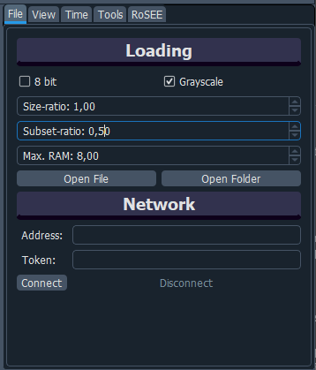
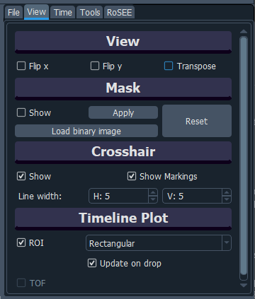
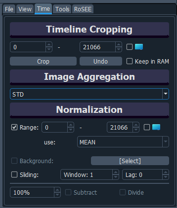

# Tab Options Explained

Detailed explanation of all TAB options.

## Table of Contents

- [File](#file) — Optimize hardware resource use, loading time, and UI responsiveness.
- [View](#view) — Manipulate raw images and change GUI behavior.
- [Time](#time) — Temporal manipulations.
- [Tools](#tools) — Measuring tools.
- [RoSEE](#rosee) — "Robust and Simple Event Extraction."

## File

You can load data by pressing the `Open File` or `Open Folder` button or by dragging and dropping a file or folder into the center part of the application.

#### Loading Options

Quickly configure how data is loaded to optimize performance based on your computer's capabilities. For example, when handling 40,000 images, it’s advisable to start with a subset (e.g., 0.01) and gradually increase it. Additionally, consider initially loading images in grayscale for quick screening and later switching to color for detailed analysis. These choices help to manage BLITZ's hardware load efficiently.

- **8-bit**: Convert images to 8-bit color depth during loading.
- **Grayscale**: Convert images to grayscale during loading.
- **Size-ratio**: Resize images to a specified ratio during loading (useful for reducing the footprint in RAM, ideal for screening many images).
- **Subset-ratio**: Load a specified subset of the image set in an equidistant manner (e.g., Imageset = (1,3,5,...) or (1,4,7,...)).
- **Max. RAM**: Define the maximum amount of RAM (in GB) that BLITZ can use for loading images.

### Network Options

BLITZ can be integrated with **WOLKE**, a browser-based datacrawler for images. This allows for pre-selection of images based on metadata criteria. Use the IP and the generated Token to connect to the WOLKE server for optimal data flow.

### Additional Remarks

- When a folder is loaded, BLITZ inspects all files and loads those with the most frequent file suffix.
- For `.npy` files, the array shapes can be `(N, m, n)`, `(m, n)`, or `(N, m, n, 3)` for color images, where `N` is the number of images and `m, n` are the image dimensions. The _grayscale_ option determines how 3-dimensional arrays are processed.
- For video files, BLITZ will determine the frame extraction frequency based on parameters such as _8-bit_, _Subset-ratio_, _Size-ratio_, and _Max. RAM_ settings.

Each option allows for flexible and efficient management of large datasets, ensuring that your hardware resources are optimized for performance and responsiveness.

## View

#### Image Manipulation

- **Flip x**: Flip the image along the x-axis.
- **Flip y**: Flip the image along the y-axis.
- **Transpose**: Swap the rows and columns of the image matrix. (Mathematically this is a rotation of 90 degress plus flipping)

### Mask

Control the masking options for your images. Images will be kept in RAM, but calculations will be done only for the non-masked region. This improves speed.

#### Checkbox:

- **Show**: Show the mask on the image. Use the handles to alter the mask.

#### Buttons:

- **Apply**: Apply the current mask to the image.
- **Load binary image**: Select a binary image of the same size as the current data to mask all pixels where the binary image has value 1.
- **Reset**: Reset the mask and show the original image.

### Crosshair

Settings for displaying the crosshair on the image.

#### Checkbox:

- **Show**: Display the crosshair on the image.
- **Show Markings**: Show corsshair positions in the H&V Line extraction plots.

#### Spinboxes:

- **Horizontal**: Adjust the width of the horizontal extraction line for the crosshair.
- **Vertical**: Adjust the width of the vertical extraction line for the crosshair.

For the H&V Line extraction plots shown next to the image the line thickness is taken into account. Example: For a horizontal thickness of 7, we extract 7*2 +1 =15 horizontal lines in total, average them and then show the resulting line on the corresponding upper plot.

### Timeline Plot

Options for the timeline plot visualization.

#### Checkbox:

- **ROI**: Turn on the Region of Interest (ROI) that shows the mean of all pixels in its range over time.
  - **Spinnerbox format**: Choose a format for the ROI (e.g., Rectangular / Polygon).
  - **Update on drop**: Whether to update the ROI plot upon dragging the ROI or only on drop (releasing the mouse button).

#### Additional Checkbox:

- **TOF**: Include the Time of Flight (TOF) data in the timeline plot.

## Time

The **Time Tab** allows for temporal cropping, image aggregation, and normalization of your dataset.

### Timeline Cropping

- **Start Frame:** Specifies the start frame for cropping the dataset (Default: `0`, Adjustable).
- **End Frame:** Specifies the end frame for cropping the dataset (Default: `max`, Adjustable).
- **Blue Checkbox:** Display the range defined by Start and End Frame as a blue box in the timeline.
- **Crop Button:** Crop the dataset to the specified range.
- **Undo Button:** Revert the cropping action.
- **Keep in RAM:** Retain cropped frames in memory for quicker access.

### Image Aggregation

**Method Dropdown:** Choose the method for image aggregation:
  - **None:** Display the normal image without aggregation.
  - **MEAN:** Calculate the per-pixel average of the dataset.
  - **MAX:** Calculate the per-pixel maximum of the dataset.
  - **MIN:** Calculate the per-pixel minimum of the dataset.
  - **STD:** Calculate the per-pixel standard deviation of the dataset.

#### Explanation

BLITZ utilizes a matrix-based approach, performing aggregations for each pixel over time. You can easily switch between the aggregations using the mouse-wheel, when hovering over the dropdown field. These aggregated images provide insights into the spread and variability of your dataset.

A nice way of reducing your data for instance:
- Start with the **Max Image** for a quick overview.
- Crop the dataset based on this information using the "View" Tab.
- Return back to the **Time Tab** and switch back to "None", showing the cropped dataset with only the crucial region visible.

### Normalization

Normalization allows for the adjustment and fluctuation analysis of your dataset.

### Range
Here you can define how your base image for normalization is calculated:

- **Start Frame:** Specifies the start frame for normalization (Adjustable).
- **End Frame:** Specifies the end frame for normalization (Adjustable).
- **Use:** Choose the metric for normalization from a dropdown (Options: Min, Max, Mean, STD).

### Background
You can also provide a single file from somewhere else (must be equal in size as the dataset)

- **Background Checkbox:** Enable background subtraction or division.
- **Background Select Button:** Select a background image of the same size as the dataset.

### Sliding Window

A powerful technique for detecting changes and movements in temporal datasets.

- **Window:** The number of frames to average (Adjustable).
- **Lag:** The delay between the current frame and the sliding window (Adjustable).

### Normalization Options

These controls dictate how normalization is applied to the dataset.

- **100% Dropdown:** Select the percentage for normalization.
- **Subtract Checkbox:** Enable subtraction normalization, which is useful for highlighting fluctuations.
- **Divide Checkbox:** Enable division normalization, useful for adjusting image brightness.

#### Explanation

For many datasets, focusing on fluctuation rather than absolute values is key. Subtraction effectively highlights changes by reducing steady-state regions to black, while division can equalize brightness variations, often making the image appear more grayish.

In the case of subtraction, the lookup table switches to a red/blue gradient, instantly indicating which parts of the image are above or below the mean. You can control the percentage effect and select the normalization method (e.g., mean, min, max, std).

Another common technique is "foreground detection" using a sliding window. For example, with a window of 5 frames and a lag of 2 frames, the algorithm highlights movement by comparing the current frame with frames from earlier and later, reducing the influence of stationary elements.

This method is particularly effective for timelapse videos, where you might want to focus on movement despite variations in lighting or other unchanged background elements. Combined with the temporal evolution of the intensity of the Region of Interest (ROI) in the lower graph, you can easily observe movement trends in critical areas.
