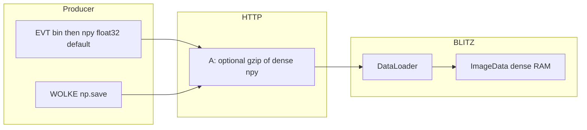
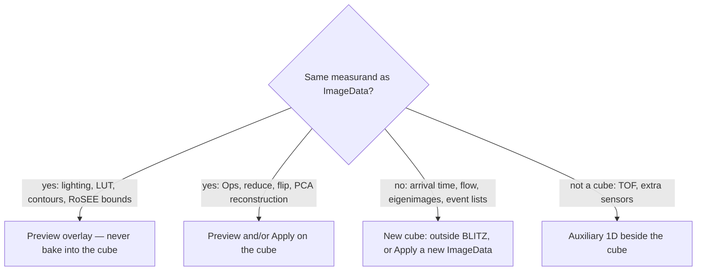
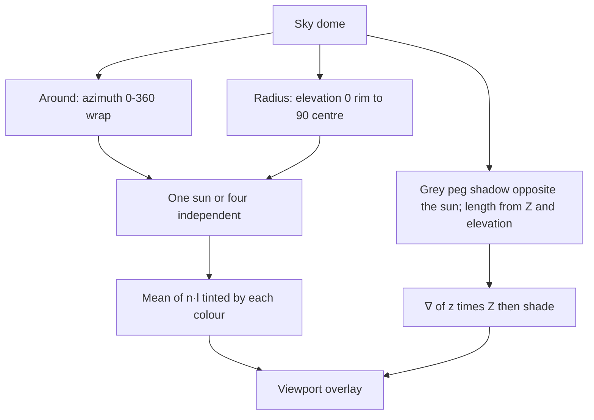
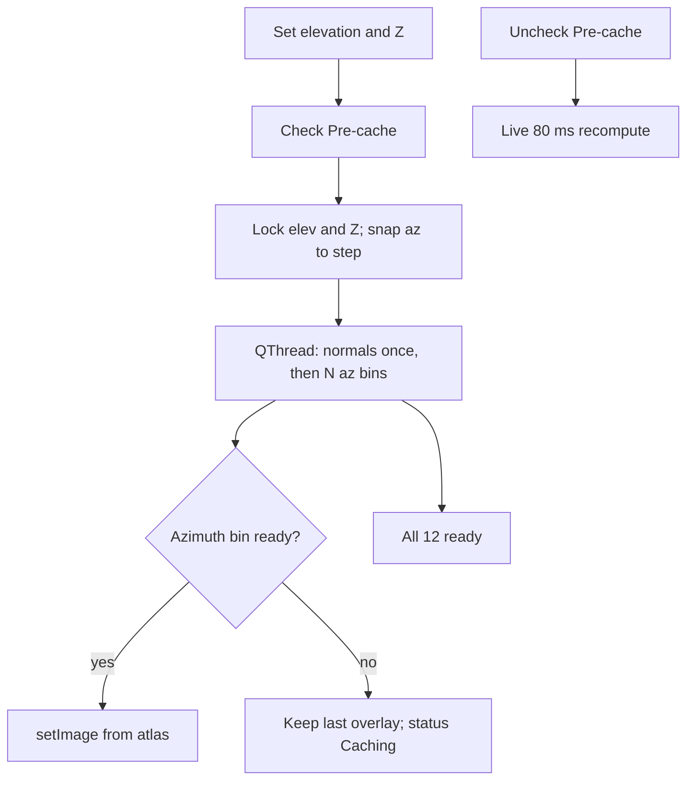

# Architecture & Code Analysis

## Data Sources & Build Variants

Fuer Standard vs. Full Build, Loader/Converter/Handler und die Dependency-Regel siehe **`docs/sources_and_variants.md`**.

---

## Overview

BLITZ is a Python-based image viewer and analysis tool built with **PyQt6** and **PyQtGraph**. It is designed to handle large datasets by loading them into memory (RAM) and offering efficient slicing, aggregation, and visualization.

Network `.npy` ingest stays a dense blob. The Event reader gzip is opt-in and
off on loopback. The Connect button and the **NET** / **BUSY** badge show
download percent so a large stack is not silent. After load, `ImageData` is
still a dense NumPy cube. Contrast is a LUT/display concern (Fit / Trim),
not a load-time threshold.

See [`../WETTER/docs/sparse_matrices.md`](../WETTER/docs/sparse_matrices.md).

## Cube measurand rule

BLITZ analyzes **one** dense `ImageData` cube. Features must not pretend a
different physical quantity is that cube.

- **Same measurand, display only** — Preview. Shade hillshade, LUT, isolines.
  Probe / polyline / PCA keep reading height or intensity. **Shade must not
  Apply-replace the stack** (that would store lighting `0…1` as if it were the
  measurement).
- **Same measurand, arithmetic / reduce** — Preview and/or Ops **Apply to full**.
  Load 8-bit / grayscale / subset chooses the cube at ingest; that is not an
  overlay.
- **New measurand** — Produce the cube **outside** (EVT / converters / a later
  sidecar) or **Apply** a distinct `ImageData` the user can leave. Do not overlay
  it on the original. PCA **View components** already swaps in eigenimages and
  restores via **View PCA** off — that is Apply-as-view-swap, not a Shade-style
  overlay.
- **Auxiliary 1D** — TOF today; more sensor curves later. Not a cube overlay.

Hillshade **Pre-cache** is paint optimization only (not a new measurand, not
Apply). Azimuth `0°` is screen north (top of the image). The viewer ViewBox
uses `invertY`, so the light vector is `ly = -cos(az)` (same as gdaldem);
east/west stay `lx = sin(az)`. Freeze elevation and Z factor, then build an azimuth atlas for the
**current viewport** of the current `T` frame on a worker thread (step 5–90°,
default 30°; 5° is the finest). Overlay paint crops the ViewBox (1 px halo) and
downsamples to about screen size. The RAM line uses that patch. Combined mode
blends independent coloured lights (Preset = four at 90°, same elevation).
Optional later: cache the current angles over `T` so timeline scrub stays smooth.

## Directory Structure

*   **`blitz/`**: The main package.
    *   **`data/`**: Handles data loading, image processing, and in-memory representation (`ImageData`).
    *   **`layout/`**: Contains the UI logic.
        *   `main.py`: The `MainWindow` logic, connecting UI events to data operations.
        *   `ui.py`: The visual layout definition (Widgets, Layouts, Docks).
        *   `viewer.py`: Custom `ImageViewer` widget based on PyQtGraph.
    *   **`tools.py`**: Utility functions (logging, loading dialogs, RAM checks).
    *   **`settings.py`**: Settings management (possibly singleton-based).
    *   **`app.py`**: Application entry point logic.

## Key Components

### 1. Data Layer (`blitz/data`)
*   **`ImageData` (`image.py`)**: The core class wrapping a 4D Numpy array (`(Time, Width, Height, Channel)`). It handles:
    *   Lazy evaluation of crops, masks, and flips.
    *   Normalization (subtract/divide).
    *   Reduction (Mean, Max, Min, Std).
    *   **`image_timeline`**: Property fuer die Timeline im Aggregate-Modus – liefert vollen Stack (norm + mask) ohne Reduce. Siehe `docs/timeline_aggregation.md`.
*   **`DataLoader` (`load.py`)**: Responsible for reading files (Images, Video, Numpy). It uses `multiprocessing.Pool` for parallel loading of large image sequences.

### 2. UI Layer (`blitz/layout`)
*   **`MainWindow` (`main.py`)**: The central controller. It initializes the UI, handles signals from widgets, and orchestrates calls to `DataLoader` and `ImageData`.
*   **`UI_MainWindow` (`ui.py`)**: strictly setup code for creating widgets and placing them in docks.
*   **`ImageViewer` (`viewer.py`)**: Custom wrapper around `pyqtgraph.ImageView` or similar, tailored for the specific interactions needed (ROI, time slicing).

## Current Issues / Technical Debt

1.  **Tight Coupling in `MainWindow`**:
    *   `MainWindow` directly accesses UI widgets (e.g., `self.ui.checkbox_norm_subtract`).
    *   It contains mixed logic: file dialog handling, settings synchronization, event handlers, and some business logic orchestration.
    *   This makes it a "God Class" that is hard to test and maintain.

2.  **`DataLoader` Responsibilities**:
    *   It mixes file format detection, UI logging (calls `log`), and raw data loading.
    *   The `from_text` method creates a dummy image with text, which is a bit of a hack for error reporting.

3.  **Global State/Singletons**:
    *   `tools.py` uses a global `LOGGER`.
    *   `settings.py` (inferred) likely acts as a global configuration store.

4.  **Error Handling**:
    *   Exceptions are often caught and logged to the UI, sometimes swallowing the stack trace or using generic error messages.

5.  **Project Management**:
    *   `uv` is used for dependency management (pyproject.toml, uv.lock).
    *   No formal test suite exists.

## Improvement Plan (Summary)

1.  ~~**Migration**: Switch to `uv` for faster, cleaner dependency management.~~ (erledigt)
2.  **Refactoring**:
    *   Extract logic from `MainWindow` into specialized handlers (e.g., `ProjectHandler`, `ViewSettingsHandler`).
    *   Decouple `DataLoader` from UI logging (return errors/status instead of printing directly).
3.  **Standardization**: Apply `ruff` for consistent code style.
