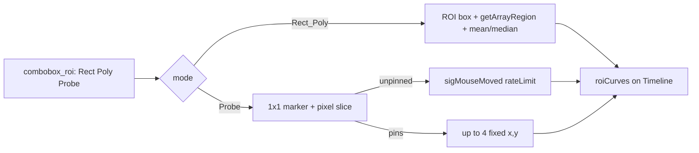

# Timeline & Aggregation

Documentation of the Timeline Panel and Aggregate Mode.

## Timeline Panel (Bottom)

Two tabs control the mode:

- **Frame:** Single-frame mode. The *Idx* spinner selects the current frame.
- **Aggregate:** Aggregation mode. The *Reduce* method (Mean, Max, Min, Std) and *Range* (Start/End) define the result.

### Frame Tab

- **Idx Spinner:** Current frame index (always active when data is loaded).
- **Bands:** Checkbox. Shows the Min/Max curve (green band) in the timeline plot (ROI modes only).
- **Curve:** Dropdown Mean/Median. Aggregation within the ROI per frame for the timeline curve (disabled in Live Probe).

### Aggregate Tab

- **Reduce:** Method to collapse frames (None - current frame, Mean, Max, Min, Std).
- **Start / End:** Range of frames to aggregate.
- **Win const.:** Window length remains constant when changing Start/End via spinners. When dragging range handles, the window adapts to the new span.
- **Full Range:** Resets range to 0..max (full length).
- **Update on drag:** Checkbox. If enabled, aggregation updates live while dragging the range slider (resource intensive); otherwise, only on release.

### Timeline sampling (View → Timeline Plot)

Combo: **Rectangular | Polygon | Live Probe**.

- **Rectangular / Polygon:** Zonal ROI on the image; timeline shows mean/median (optional min/max bands) over the region for every frame.
- **Live Probe:** ROI box hidden; teal live ghost (outline only — Linked Cursor keeps the top-right intensity tip). Up to **N pins** via **Max pins** (1–4, default 2). Timeline: solid pin curves + dashed live preview while pins are set. Click adds/removes pins; at cap, new click replaces oldest. Esc clears pins; **Clear pins** also recenters.
- Independent of the Probe dock (current-frame value under cursor) and of Linked cursor.

---

## Technical Design: Timeline in Aggregate Mode

**Problem:** In Aggregate mode (e.g., switching to Mean), the timeline would effectively become invisible (reduced to a single point because the image is collapsed to 2D).

**Solution:** The timeline **always** shows the full time series (ROI or probe curve over all frames), even in Aggregate mode.

### Data Flow

| Component | Frame Mode | Aggregate Mode |
|-----------|------------|----------------|
| **Image** | Current Frame | Reduced Result (e.g., Mean over Range) |
| **Timeline Curve (ROI)** | ROI-Mean/Median per frame | Same over **all** frames |
| **Timeline Curve (Live Probe)** | Pixel series `[:, x, y]` | Same over **all** frames from `image_timeline` |
| **Timeline Source** | `getProcessedImage()` | `data.image_timeline` |
| **Range (crop_range)** | Hidden | Visible, highlights the aggregated range |

### `ImageData.image_timeline`

Property in `blitz/data/image.py`:

- Returns the **full stack** (norm + mask, **without** reduce).
- Used only in Aggregate mode (`_redop` is set).
- Calculated on-the-fly – no permanent RAM overhead.
- Respects: Norm pipeline, Mask (`_image_mask`, `_mask`), Crop, Rotate 90°, Flip.

### Implementation (`blitz/layout/viewer.py`)

- Sample mode: `_timeline_sample_mode` ∈ `{rect, poly, probe}`; UI via `combobox_roi`.
- Probe overlay: `TimelineProbeController` in `widgets.py` (hover + click pin).
- `roiChanged` checks `in_agg` (`data._redop` set and `image_timeline` present).
- If `in_agg`: data from `data.image_timeline`, X-values = `np.arange(n_frames)`.
- Probe path: pixel slice instead of `getArrayRegion` + spatial agg.
- X-Range and timeline bounds are set to `0..n-1` in Aggregate.
- Auto-Zoom: `roiPlot.plotItem.vb.autoRange()` called after every `roiChanged` (Frame mode).

---

## Ops Tab

**Ops** is a dedicated tab in the Options Dock. Subtract and Divide use the same reference source logic:

- **Subtract:** Source Off | Aggregate | File | Sliding Range, Amount 0-100%
- **Divide:** Source Off | Aggregate | File | Sliding Range, Amount 0-100%
- **Aggregate:** Uses the Range and Reduce method from the Aggregate Tab.
- **File:** Loaded reference image (Dark Frame, Flat Field).
- **Sliding Range:** Uses a moving window (Window/Lag) defined in the Ops tab.

Subtract and Divide can be combined (e.g., Subtract: File, Divide: Aggregate).
